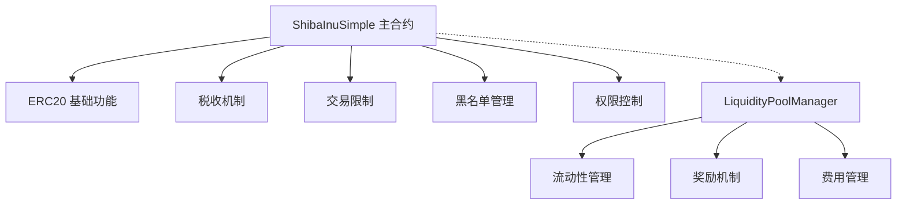

# SHIB风格Meme代币技术实现文档

## 🏗️ 架构设计

### 核心合约架构



### 数据结构设计

```solidity
contract ShibaInu is ERC20, Ownable, ReentrancyGuard {
    // ============ 状态变量 ============
    
    // 税收相关
    uint256 public buyTax = 3;      // 买入税 3%
    uint256 public sellTax = 5;     // 卖出税 5%
    
    // 钱包地址
    address public liquidityWallet;
    address public marketingWallet;
    
    // 交易限制
    uint256 public maxTransactionAmount;
    uint256 public maxWalletAmount;
    uint256 public swapTokensAtAmount;
    
    // 交易控制
    bool public tradingEnabled = false;
    uint256 public transactionCooldown = 30; // 30秒冷却
    uint256 public maxDailyTransactions = 10;
    
    // 映射
    mapping(address => bool) public blacklist;
    mapping(address => bool) public isExcludedFromFees;
    mapping(address => bool) public isExcludedFromLimits;
    mapping(address => uint256) public lastTransactionTime;
    mapping(address => uint256) public dailyTransactionCount;
    mapping(address => uint256) public lastTransactionDay;
    
    // Uniswap集成
    address public uniswapV2Router;
    address public uniswapV2Pair;
}
```

## 🔧 核心功能实现

### 1. 税收机制实现

**核心逻辑：** 重写ERC20的`_update`函数

```solidity
function _update(
    address from,
    address to,
    uint256 amount
) internal override {
    require(to != address(0), "ERC20: transfer to the zero address");
    
    // 允许铸造（from == address(0)）和销毁（to == address(0)）
    if (from != address(0) && to != address(0)) {
        require(!blacklist[from] && !blacklist[to], "Blacklisted address");
        require(amount > 0, "Transfer amount must be greater than zero");
        
        // 检查交易是否已启用
        if (!tradingEnabled) {
            require(
                isExcludedFromLimits[from] || isExcludedFromLimits[to],
                "Trading not yet enabled"
            );
        }
        
        // 检查交易限制
        if (!isExcludedFromLimits[from] && !isExcludedFromLimits[to]) {
            require(amount <= maxTransactionAmount, "Transfer amount exceeds the maxTransactionAmount");
            
            // 检查接收方钱包持有量限制（除了卖给交易对的情况）
            if (to != uniswapV2Pair) {
                require(
                    balanceOf(to) + amount <= maxWalletAmount,
                    "Exceeds maximum wallet token amount"
                );
            }
        }
        
        // 检查是否需要收取税费
        bool takeFee = false;
        
        // 只有买入或卖出交易才收取费用
        if (from == uniswapV2Pair || to == uniswapV2Pair) {
            takeFee = true;
        }
        
        // 如果发送方或接收方被排除在费用之外，则不收取费用
        if (isExcludedFromFees[from] || isExcludedFromFees[to]) {
            takeFee = false;
        }
        
        // 执行转账和税费计算
        if (takeFee) {
            uint256 totalTaxes = 0;
            
            // 买入交易（从交易对买入）
            if (from == uniswapV2Pair) {
                totalTaxes = buyTax;
            }
            // 卖出交易（卖给交易对）
            else if (to == uniswapV2Pair) {
                totalTaxes = sellTax;
            }
            
            // 计算税费金额
            uint256 taxAmount = amount * totalTaxes / 100;
            uint256 transferAmount = amount - taxAmount;
            
            // 执行转账
            super._update(from, to, transferAmount);
            
            // 收取税费到合约地址
            if (taxAmount > 0) {
                super._update(from, address(this), taxAmount);
            }
            return;
        }
    }
    
    // 不收取费用的直接转账（包括铸造和销毁）
    super._update(from, to, amount);
}
```

**关键设计要点：**
1. **税费判断：** 只有涉及交易对的转账才收税
2. **双重检查：** 发送方和接收方都不能被排除在税费之外
3. **灵活配置：** 买入税和卖出税可以分别设置
4. **安全优先：** 先执行所有验证，再处理转账

### 2. 交易限制机制

**频率限制修饰符：**

```solidity
modifier rateLimited(address user) {
    if (!isExcludedFromLimits[user]) {
        require(
            block.timestamp >= lastTransactionTime[user] + transactionCooldown,
            "Transaction too frequent"
        );
        lastTransactionTime[user] = block.timestamp;
        
        // 检查每日交易次数
        uint256 currentDay = block.timestamp / 1 days;
        if (lastTransactionDay[user] != currentDay) {
            dailyTransactionCount[user] = 0;
            lastTransactionDay[user] = currentDay;
        }
        
        require(
            dailyTransactionCount[user] < maxDailyTransactions,
            "Daily transaction limit exceeded"
        );
        dailyTransactionCount[user] = dailyTransactionCount[user] + 1;
    }
    _;
}
```

**限制类型：**
- 单笔交易金额限制
- 钱包最大持有量限制
- 交易频率限制（冷却时间）
- 每日交易次数限制

### 3. 权限管理系统

**多级权限设计：**

```solidity
// 管理员权限（onlyOwner）
function enableTrading() external onlyOwner
function updateTaxes(uint256 _buyTax, uint256 _sellTax) external onlyOwner
function updateTransactionLimits(uint256 _maxTx, uint256 _maxWallet) external onlyOwner

// 免税地址管理
function excludeFromFees(address account, bool excluded) external onlyOwner

// 免限制地址管理  
function excludeFromLimits(address account, bool excluded) external onlyOwner

// 黑名单管理
function addToBlacklist(address account) external onlyOwner
function removeFromBlacklist(address account) external onlyOwner
```

## 🧪 测试架构设计

### 测试用例分类

```javascript
describe("ShibaInuSimple Token 测试", function () {
    // 1. 基础功能测试
    describe("🏗️ 合约部署测试", function () {
        // 验证合约初始化状态
    });
    
    describe("💰 基本 ERC20 功能测试", function () {
        // 验证标准ERC20功能
    });
    
    // 2. 核心机制测试
    describe("📊 代币税机制测试", function () {
        // 验证买入税、卖出税、免税转账
    });
    
    describe("🚫 交易限制功能测试", function () {
        // 验证各种交易限制
    });
    
    // 3. 管理功能测试
    describe("⚙️ 管理员功能测试", function () {
        // 验证权限控制和参数设置
    });
    
    // 4. 集成功能测试
    describe("💧 流动性池管理测试", function () {
        // 验证与流动性池的集成
    });
    
    // 5. 查询和边界测试
    describe("🔍 查询功能测试", function () {
        // 验证状态查询功能
    });
    
    describe("🚨 边界条件测试", function () {
        // 验证边界情况处理
    });
});
```

### 关键测试策略

**1. 税收机制测试：**
```javascript
it("从交易对购买应收取买入税", async function () {
    // 关键：确保测试地址不被排除在税费之外
    await shibToken.excludeFromFees(addr3.address, false);
    await shibToken.excludeFromFees(addr1.address, false);
    
    // 验证税费计算
    const expectedAmount = buyAmount * 97n / 100n; // 3%税费
    const expectedTax = buyAmount * 3n / 100n;
    
    // 验证余额变化
    expect(addr1BalanceAfter - addr1BalanceBefore).to.equal(expectedAmount);
    expect(contractBalanceAfter - contractBalanceBefore).to.equal(expectedTax);
});
```

**2. 权限测试：**
```javascript
it("只有所有者能够启用交易", async function () {
    await expect(
        shibToken.connect(addr1).enableTrading()
    ).to.be.revertedWithCustomError(shibToken, "OwnableUnauthorizedAccount");
});
```

**3. 限制测试：**
```javascript
it("应该限制单笔交易金额", async function () {
    // 设置符合合约要求的最小限制
    const newMaxTx = ethers.parseEther("1000000"); // 总供应量的0.1%
    await shibToken.updateTransactionLimits(newMaxTx, ethers.parseEther("5000000"));
    
    // 测试超限交易
    const exceedAmount = newMaxTx + ethers.parseEther("1");
    await expect(
        shibToken.connect(addr4).transfer(addr5.address, exceedAmount)
    ).to.be.revertedWith("Transfer amount exceeds the maxTransactionAmount");
});
```

## 🚀 部署架构

### 多网络部署配置

```javascript
// hardhat.config.js
module.exports = {
  solidity: {
    version: "0.8.20",
    settings: {
      optimizer: {
        enabled: true,
        runs: 200
      }
    }
  },
  networks: {
    hardhat: {
      chainId: 31337
    },
    localhost: {
      url: "http://127.0.0.1:8545",
      chainId: 31337
    },
    sepolia: {
      url: process.env.SEPOLIA_RPC_URL,
      accounts: process.env.PRIVATE_KEY ? [process.env.PRIVATE_KEY] : [],
      gas: 6000000,
      gasPrice: 20000000000
    },
    mainnet: {
      url: process.env.MAINNET_RPC_URL,
      accounts: process.env.PRIVATE_KEY ? [process.env.PRIVATE_KEY] : [],
      gas: 5000000,
      gasPrice: 30000000000
    }
  }
};
```

### 部署流程设计

```javascript
const deployToNetwork = async (networkName) => {
    console.log(`🚀 开始部署到 ${networkName} 网络...`);
    
    // 1. 获取网络配置
    const networkConfig = getNetworkConfig(networkName);
    const { routerAddress, liquidityWallet, marketingWallet } = networkConfig;
    
    // 2. 部署主代币合约
    const ShibaInu = await ethers.getContractFactory("ShibaInu");
    const shibToken = await ShibaInu.deploy(
        TOKEN_NAME,
        TOKEN_SYMBOL,
        TOTAL_SUPPLY,
        routerAddress,
        liquidityWallet,
        marketingWallet
    );
    await shibToken.waitForDeployment();
    
    // 3. 创建交易对
    const pairAddress = await createUniswapPair(shibToken, routerAddress);
    
    // 4. 部署流动性管理合约
    const LiquidityPoolManager = await ethers.getContractFactory("LiquidityPoolManager");
    const poolManager = await LiquidityPoolManager.deploy(
        await shibToken.getAddress(),
        routerAddress,
        pairAddress
    );
    await poolManager.waitForDeployment();
    
    // 5. 配置合约
    await shibToken.setUniswapV2Pair(pairAddress);
    
    // 6. 启用交易（谨慎操作）
    if (networkName !== 'mainnet') {
        await shibToken.enableTrading();
    }
    
    // 7. 保存部署信息
    saveDeploymentInfo(networkName, {
        shibToken: await shibToken.getAddress(),
        poolManager: await poolManager.getAddress(),
        pairAddress
    });
    
    console.log("✅ 部署完成！");
};
```

## 📊 Gas优化策略

### 1. 存储优化

```solidity
// 打包存储变量以节省gas
struct UserInfo {
    uint128 balance;           // 足够存储代币余额
    uint64 lastTransactionTime; // 时间戳
    uint32 dailyTransactionCount; // 每日交易次数
    uint32 lastTransactionDay;   // 最后交易日
}

mapping(address => UserInfo) public userInfo;
```

### 2. 计算优化

```solidity
// 使用位运算优化除法
uint256 taxAmount = amount * totalTaxes / 100;  // 直接除法，编译器优化

// 避免重复计算
uint256 contractAddress = address(this);
```

### 3. 事件优化

```solidity
// 高效的事件设计
event TaxCollected(address indexed from, address indexed to, uint256 amount, uint256 tax);
event TradingEnabled(uint256 timestamp);
event TransactionLimitUpdated(uint256 maxTransaction, uint256 maxWallet);
```

## 🔒 安全措施

### 1. 重入攻击防护

```solidity
// 使用OpenZeppelin的ReentrancyGuard
contract ShibaInu is ERC20, Ownable, ReentrancyGuard {
    function someFunction() external nonReentrant {
        // 防止重入攻击
    }
}
```

### 2. 整数溢出防护

```solidity
// Solidity 0.8.x 内置溢出检查
uint256 taxAmount = amount * totalTaxes / 100; // 自动检查溢出
```

### 3. 权限控制

```solidity
// 多层权限验证
modifier onlyOwner() {
    require(owner() == _msgSender(), "Ownable: caller is not the owner");
    _;
}

// 参数验证
function updateTaxes(uint256 _buyTax, uint256 _sellTax) external onlyOwner {
    require(_buyTax <= 10, "Buy tax too high"); // 最大10%
    require(_sellTax <= 15, "Sell tax too high"); // 最大15%
    // ...
}
```

## 📈 监控和维护

### 1. 事件监听

```javascript
// 监听重要事件
shibToken.on("TaxCollected", (from, to, amount, tax) => {
    console.log(`税费收集: ${tax} 代币`);
});

shibToken.on("TradingEnabled", (timestamp) => {
    console.log(`交易已启用: ${new Date(timestamp * 1000)}`);
});
```

### 2. 状态查询

```solidity
// 提供详细的状态查询功能
function getAccountStats(address account) external view returns (
    uint256 balance,
    bool isExcludedFromFees_,
    bool isExcludedFromLimits_,
    bool isBlacklisted
) {
    return (
        balanceOf(account),
        isExcludedFromFees[account],
        isExcludedFromLimits[account],
        blacklist[account]
    );
}
